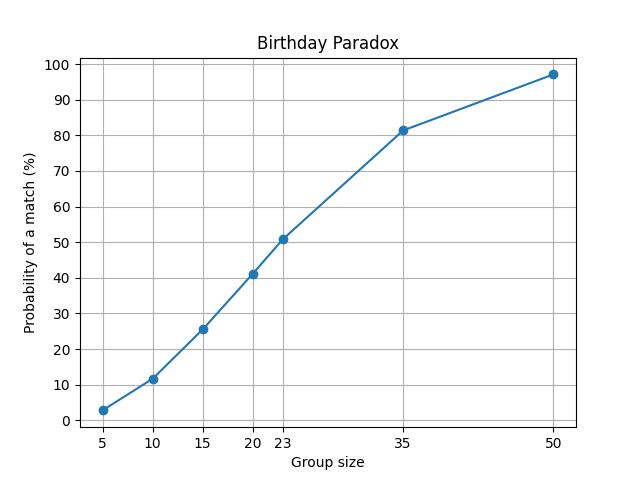

# BirthdaySim - Birthday Paradox Simulator

A Python project that simulates the [Birthday Paradox](https://en.wikipedia.org/wiki/Birthday_problem) - the surprising
probability that two people in a group share the same birthday.

## What is the Birthday Paradox?

The Birthday Paradox states that in a group of just **23 people**, there's roughly a **50% chance** that two of them
share a birthday. By the time the group reaches 50 people, the probability jumps to over **97%**. This feels
counterintuitive, which is why it's called a "paradox".

## Features

- Runs configurable Monte Carlo simulations across multiple group sizes
- Logs results to CSV for persistence and later analysis
- Generates a line graph visualizing the probability curve
- Includes a Jupyter Notebook for interactive exploration

## Project Structure

```
BirthdayDataSimulator/
├── birthday_sim.py
├── notebooks/
│   └── birthday_sim.ipynb
├── data/
│   └── simulations.csv
├── plots/
│   └── simulation_graph.png
├── .gitignore
├── LICENSE
├── README.md
└── requirements.txt
```

## Installation

```bash
git clone https://github.com/akilary/BirthdayDataSimulator.git
cd BirthdayDataSimulator
pip install -r requirements.txt
```

## Usage

### Run from command line

```python
from birthday_sim import BirthdaySim

sim = BirthdaySim(total_simulations=100000, group_sizes=[5, 10, 15, 20, 23, 25, 50])
sim.simulate()
sim.draw_graph()
```

### Save the graph to a file

```python
sim.draw_graph(save=True)
```

### Use a custom CSV path

```python
sim.SIMULATIONS_SAVE_PATH = "my_results/output.csv"
sim.simulate()
```

### Jupyter Notebook

```bash
jupyter notebook notebooks/birthday_sim.ipynb
```

Or simply launch Jupyter and open the file manually:

```bash
jupyter notebook
```

## Example Output



| Group Size | Probability of Match |
|------------|----------------------|
| 5          | ~2.7%                |
| 10         | ~11.7%               |
| 15         | ~25.5%               |
| 20         | ~41.2%               |
| 23         | ~50.8%               |
| 35         | ~81.4%               |
| 50         | ~97.1%               |

## Configuration

`BirthdaySim` accepts the following parameters:

| Parameter           | Default  | Description                               |
|---------------------|----------|-------------------------------------------|
| `total_simulations` | `100000` | Number of simulation runs per group size  |
| `group_sizes`       | `23`     | Single int or list of group sizes to test |

## Requirements

- Python 3.10+
- `matplotlib`
- `jupyter` - optional, only needed to run the notebook

## License

[MIT](LICENSE)